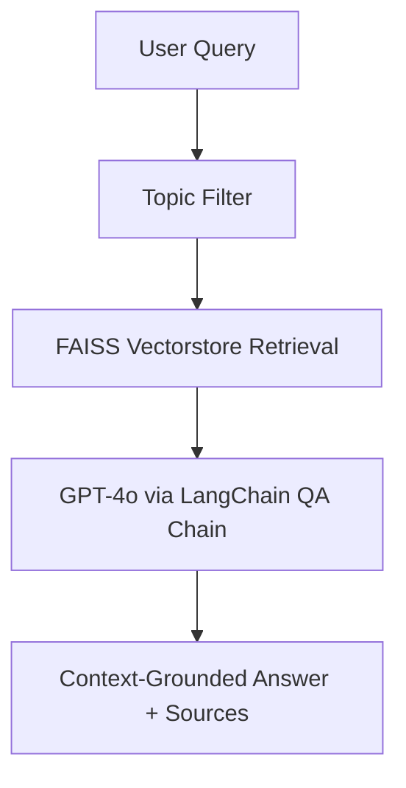

# 🩺 GenAI Healthcare Assistant (NHS Q&A Prototype)

A fast, accurate, and hallucination-resistant **GenAI assistant** built with Retrieval-Augmented Generation (RAG) to answer health-related questions using official NHS documents. The assistant uses **semantic chunking**, **FAISS vector search**, and **OpenAI's GPT-4o**, with guardrails to ensure context-grounded answers.

---

## 🚀 Features

- 🔎 **Semantic Search with OpenAI Embeddings** (`text-embedding-3-small`)
- 🤖 **Answer Generation using GPT-4o**, grounded in retrieved NHS content
- 🧱 **FAISS Vectorstore** for fast, scalable retrieval
- 📄 **PDF Loader + Chunker** using LangChain tools
- 🧠 **Conversational Memory** with context-aware responses
- 🔐 **Topic Filtering + Safety Guardrails**
  - ✅ Allowed: asthma, eczema, back pain, migraine, type 2 diabetes
  - 🚫 Blocked: cancer, depression, thyroid, etc.
- ⚙️ **FastAPI + HTML Interface** for local and production deployment
- 📚 Answers cite source documents and include disclaimers

---

## 🧠 System Architecture



---

## 🛠️ Tech Stack

| Component | Technology |
|----------|------------|
| Backend | FastAPI |
| Embedding | `text-embedding-3-small` (OpenAI) |
| Language Model | `gpt-4o` |
| Vector DB | FAISS |
| Document Loader | LangChain PDF loader |
| Chunking | RecursiveCharacterTextSplitter (800 chars, 100 overlap) |
| Guardrails | Topic filter + keyword blocklist |
| Memory | `ConversationBufferMemory` from LangChain |

---

## 📂 Project Structure

```
├── src/
│   ├── templates/             # index.html for web UI
│   ├── rag_pipeline.py        # Ask function + LangChain QA chain
│   ├── embedder.py            # Embedding setup
│   ├── loader.py              # PDF loading and chunking
├── main.py                    # FastAPI app
├── vectorstore/               # Saved FAISS index
├── data/                      # NHS PDFs
├── .env                       # API keys and environment variables
```

---

## 💬 Example Query

> **Q:** What are the symptoms of asthma?

> **A:** Asthma symptoms include shortness of breath, wheezing, chest tightness, and coughing...  
📚 *This assistant is a prototype trained only on the following NHS documents: Asthma, Eczema, Back Pain, Migraine, Type 2 Diabetes.*  
⚠️ *This is not medical advice. Always consult a healthcare professional.*

---

## 🧪 How to Run

1. Clone the repo
2. Place your NHS PDFs in the `/data` folder
3. Set your OpenAI API key in a `.env` file:
   ```env
   OPENAI_API_KEY=your-key-here
   ```
4. Run the embedding + vectorstore builder:
   ```bash
   python src/embed_docs.py  # (if created separately)
   ```
5. Start the FastAPI app:
   ```bash
   uvicorn main:app --reload
   ```

---

## 🗺️ Future Enhancements

- 🔗 Upgrade to **Graph RAG** for complex clinical relationships
- 🧠 Add SNOMED/UMLS integration for structured knowledge reasoning
- 💬 Deploy as chatbot (Gradio, Streamlit, or WhatsApp API)
- 📈 Add RAGAS metrics to evaluate hallucination risk

---

## 👤 Author

**Shashank Garg**  
📍 Data Scientist | GenAI Developer | Healthcare AI  
🔗 [LinkedIn](https://www.linkedin.com/in/shashankgarg2020/)  
💻 [GitHub](https://github.com/your-username)

---

## 📢 Disclaimer

> ⚠️ This does not provide medical advice. Always consult a qualified healthcare provider for diagnosis or treatment.

---

## ⭐ Star this repo if it helped or inspired you!
